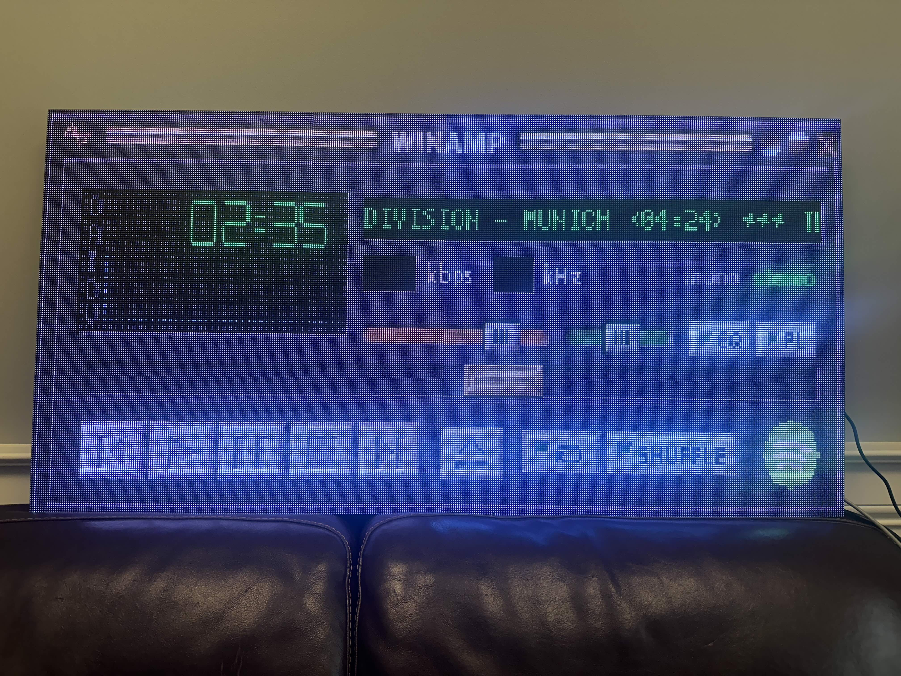

# PyCastX

PyCastX is a modular Python-powered software stack for rendering dynamic content on an LED video wall. It supports multiple applications, including live sports scores, music visualization, and video streaming, making it a flexible and powerful solution for interactive and real-time displays.

## Features
- **Live Sports Scores** – Display real-time sports scores with full team logos and graphics.
- **Music Visualization** – A Winamp-inspired interface (Spotiamp) that integrates with the Spotify API to show currently playing music.
- **Video Streaming** – Render raw video feeds from external sources such as ffmpeg.
- **Modular Architecture** – Supports multiple applications that render content onto the LED display.

## Directory Structure
```
PyCastX/
│-- utils/        # Common utility scripts for interacting with the LED video screen
|   |-- client.py # Reads raw video frames piped to STDIN and emits them over UDP
|   |-- server.py # Reads raw video frames from UDP socket and displays them on the LCD screen
│-- apps/         # Applications that render video to be displayed on the screen
│   │-- spotiamp/ # Winamp-style music visualization powered by Spotify Now-Playing API
│-- README.md     # Project documentation
```

## Installation
Each application within `apps/` maintains its own virtual environment. Follow these steps for setting up an application:

1. Clone the repository:
   ```bash
   git clone https://github.com/yourusername/PyCastX.git
   cd PyCastX
   ```
2. Navigate to the application directory:
   ```bash
   cd apps/spotiamp
   ```
3. Create and activate a virtual environment:
   ```bash
   python -m venv .venv
   source .venv/bin/activate  # Windows: .venv\Scripts\activate
   ```
4. Install dependencies:
   ```bash
   pip install -r requirements.txt
   ```

## Usage
### Running Spotiamp (Spotify Now-Playing Visualization)
1. Navigate to the `apps/spotiamp/` directory:
   ```bash
   cd apps/spotiamp
   ```
2. Activate the virtual environment:
   ```bash
   source .venv/bin/activate  # Windows: .venv\Scripts\activate
   ```
3. Run the application:
   ```bash
   python spotiamp.py
   ```

## Images
<p align="center">

</p>

## Contributing
Contributions are welcome! Feel free to open issues or submit pull requests to enhance PyCastX.

## License
This project is licensed under the MIT License.

