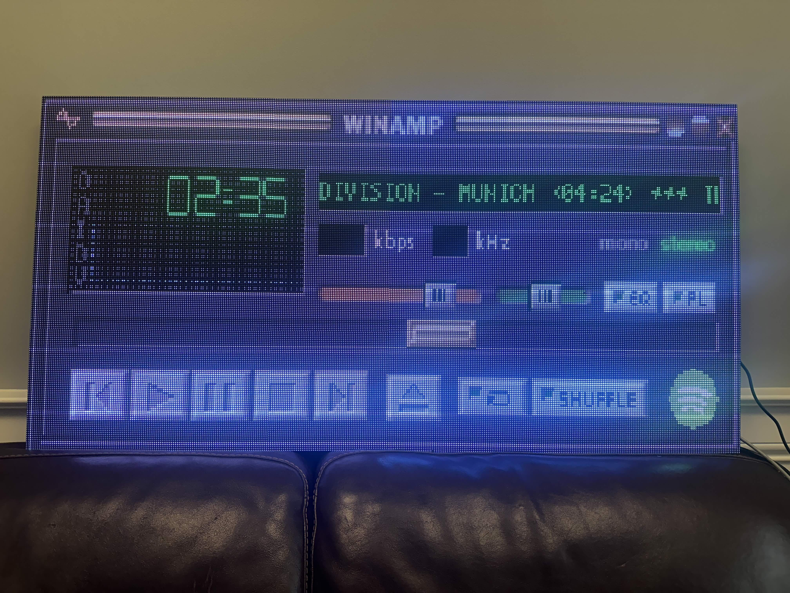

# PyCastX

PyCastX is a modular Python-powered software stack for rendering dynamic content on an LED video wall. It supports multiple applications, including live sports scores, music visualization, and video streaming, making it a flexible and powerful solution for interactive and real-time displays.

## Features
- **Live Sports Scores** – Display real-time sports scores with full team logos and graphics.
- **Music Visualization** – A Winamp-inspired interface (Spotiamp) that integrates with the Spotify API to show currently playing music with real-time audio spectrum analysis.
- **Audio Spectrum Analyzer** – Real-time FFT audio analysis captures system audio output for frequency band visualization.
- **Video Streaming** – Render raw video feeds from external sources such as ffmpeg.
- **Modular Architecture** – Supports multiple applications that render content onto the LED display.

## Directory Structure
```
PyCastX/
│-- utils/        # Common utility scripts for interacting with the LED video screen
|   |-- client.py # Reads raw video frames piped to STDIN and emits them over UDP
|   |-- server.py # Reads raw video frames from UDP socket and displays them on the LCD screen
│-- apps/         # Applications that render video to be displayed on the screen
│   │-- spotiamp/ # Winamp-style music visualization powered by Spotify Now-Playing API
│-- README.md     # Project documentation
```

## Installation

### System Dependencies

Before setting up Python virtual environments, install the required system libraries:

**Arch Linux / Manjaro:**
```bash
sudo pacman -S portaudio libpulse python-dbus
```

**Ubuntu / Debian:**
```bash
sudo apt update
sudo apt install portaudio19-dev libpulse-dev python3-dev python3-dbus
```

**Fedora / RHEL:**
```bash
sudo dnf install portaudio-devel pulseaudio-libs-devel python3-devel python3-dbus
```

### Application Setup

Each application within `apps/` maintains its own virtual environment. Follow these steps for setting up an application:

1. Clone the repository:
   ```bash
   git clone https://github.com/yourusername/PyCastX.git
   cd PyCastX
   ```

2. Navigate to the application directory:
   ```bash
   cd apps/spotiamp
   ```

3. Create and activate a virtual environment:
   ```bash
   python -m venv .venv
   source .venv/bin/activate  # Windows: .venv\Scripts\activate
   ```

4. Install Python dependencies:
   ```bash
   pip install -r requirements.txt
   ```

## Usage
### Running Spotiamp (Spotify Now-Playing Visualization)
1. Navigate to the `apps/spotiamp/` directory:
   ```bash
   cd apps/spotiamp
   ```
2. Activate the virtual environment:
   ```bash
   source .venv/bin/activate  # Windows: .venv\Scripts\activate
   ```
3. Run the application:
   ```bash
   python spotiamp.py
   ```

## Images
<p align="center">

</p>

## Troubleshooting

### Audio Visualizer Not Working

If the audio spectrum visualizer shows no activity or "SILENT" status when audio is playing:

**1. Check audio device setup (PipeWire/PulseAudio):**
```bash
cd apps/spotiamp

# Test different capture methods
python test_pipewire_capture.py

# Find monitor sources (requires libpulse)
bash find_monitor_source.sh
```

**2. Manual device configuration:**

If auto-detection fails, manually specify the audio device in your code:

```python
# In main.py or test_visualizer.py
visualizer_provider = get_visualizer_provider(
    num_bands=10,
    noise_threshold=0.0,
    device_name="pulse"  # or specific device name from test
)
```

**3. Common device names:**
- `"pulse"` - PulseAudio/PipeWire default (works on most Linux systems)
- `None` - Auto-detect monitor device
- Device number (e.g., `5`) - Specific device ID from `list_audio_devices.py`

**4. Verify PipeWire/PulseAudio compatibility:**
```bash
# Check if pipewire-pulse is running
systemctl --user status pipewire-pulse

# Install PulseAudio tools if missing
sudo pacman -S libpulse  # Arch
sudo apt install pulseaudio-utils  # Ubuntu/Debian
```

## Contributing
Contributions are welcome! Feel free to open issues or submit pull requests to enhance PyCastX.

## License
This project is licensed under the MIT License.

